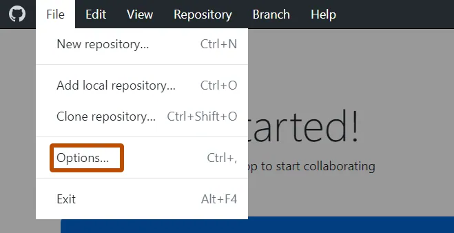
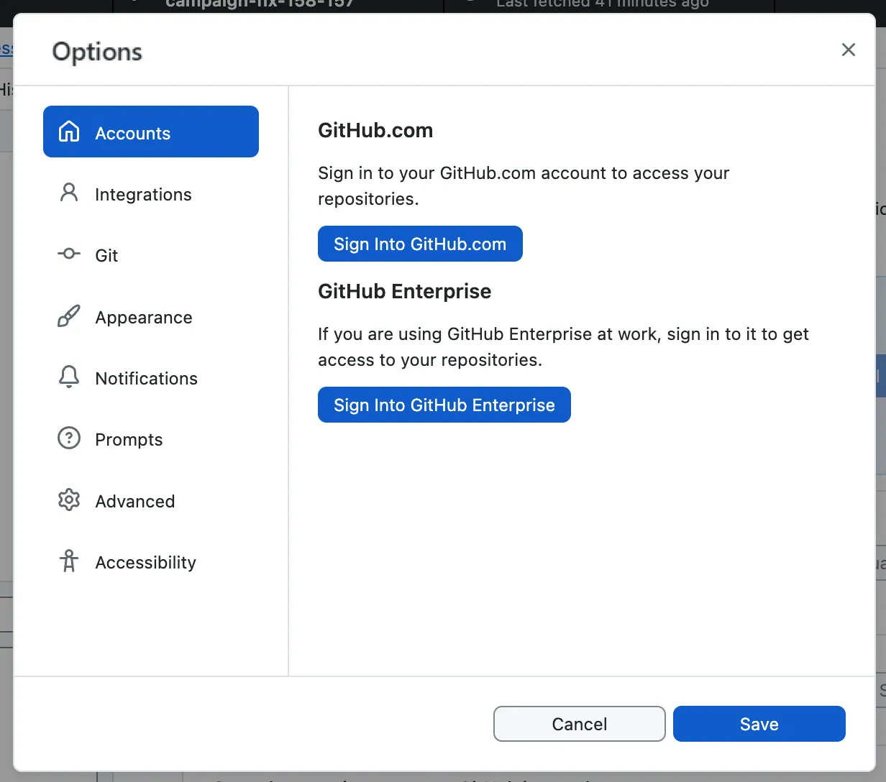

:::::::::::::::::::::::::::::::::::::: questions

- How do I get set up to use Git?
- How do I set up my account on GitHub?

::::::::::::::::::::::::::::::::::::::::::::::::

::::::::::::::::::::::::::::::::::::: objectives

- Install GitHub Desktop.
- Sign in to GitHub through GitHub Desktop.
- Understand how GitHub Desktop configures your Git identity.

::::::::::::::::::::::::::::::::::::::::::::::::

## Get Started

We'll start by exploring how version control can be used to keep track of what **one person** did and when.

First, you'll need to install **GitHub Desktop**. If you have not already, download it from [desktop.github.com](https://desktop.github.com) and run the installer.

## Setting Up GitHub

In order to make sure all our work is backed up online, as well as making it easy to share with collaborators, we're going to link our version control content to [GitHub](https://github.com/).
You'll need to [create an account there](https://github.com/signup).
As your GitHub username will appear in the URLs of your projects there, it's best to use a short, clear version of your name if you can.

:::::::: callout

## Other Platforms
There are other repository hosting sites like GitHub - Southampton has its own instance of [GitLab](https://git.soton.ac.uk) that's only accessible to Southampton user accounts.
We'll use GitHub today, as it's the easiest one to use if you want to share your code with collaborators from outside the University - getting them access to the Southampton GitLab can be difficult!
Both GitHub and GitLab have the same features, though some menu names will be different.

::::::::::::::::

## Setting Up GitHub Desktop

When you open GitHub Desktop for the first time, it will walk you through signing in to GitHub.
Click **Sign in to GitHub.com** and this will open a browser window where you can login to your account and authorise GitHub Desktop.

If you're not prompted to login to your GitHub account, go to the **File** menu and click **Options**.

{alt="GitHub Desktop dropdown menu with options highlighted"}

Then, in the **Options** window, on the **Accounts** pane, click "Sign into GitHub.com"

{alt="GitHub Desktop Git configuration screen"}

Once signed in, GitHub Desktop will ask you to **configure Git**.
It pre-fills your **name** and **email address** from your GitHub account.  These are what Git uses to record who made each change.

Check the details are correct, then click **Finish**. 

:::::::: callout

## What's Happening Under the Hood

GitHub Desktop automatically handles two things that you'd otherwise have to do manually on the command line:

**Your Git identity**: GitHub Desktop sets your name and email for you. The command-line equivalent would be:

```bash
$ git config --global user.name "Firstname Surname"
$ git config --global user.email "fsurname@university.ac.uk"
```

**Authentication**: GitHub Desktop manages its own secure credential storage, so you don't need to set up SSH keys manually to work with GitHub. If you later want to use command-line Git (for example, on a high-performance computer like Iridis), you'll need to set these up separately.

::::::::::::::::

:::::::: checklist


Before moving on, make sure you've:

- Created a GitHub account.
- Installed GitHub Desktop.
- Signed in and confirmed your Git identity is configured.

::::::::::::::::::

::::::::::::::::::::::::::::::::::::: keypoints

- GitHub Desktop handles Git configuration and authentication automatically when you sign in.
- The name and email GitHub Desktop configures are used by Git to record who made each change.
- You need a GitHub account to use GitHub Desktop.

::::::::::::::::::::::::::::::::::::::::::::::::
