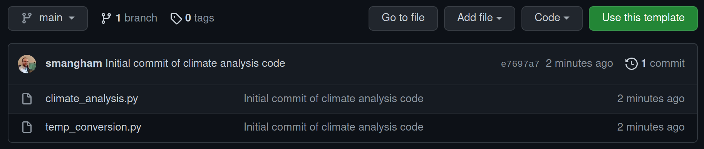
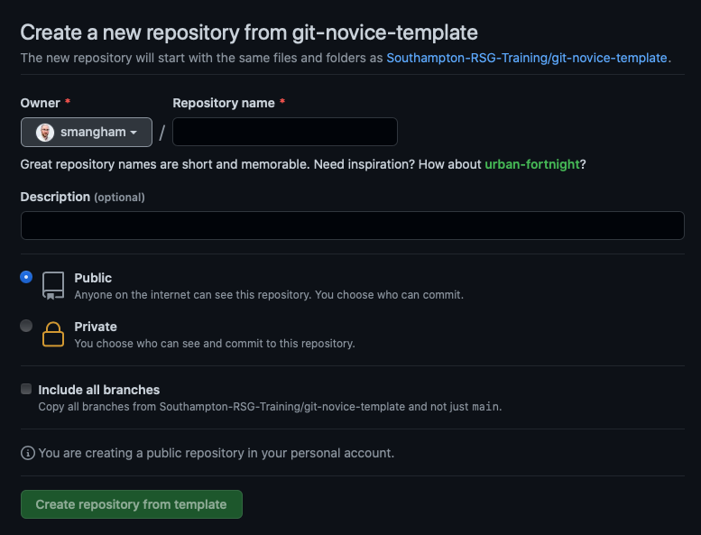
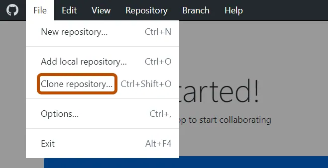
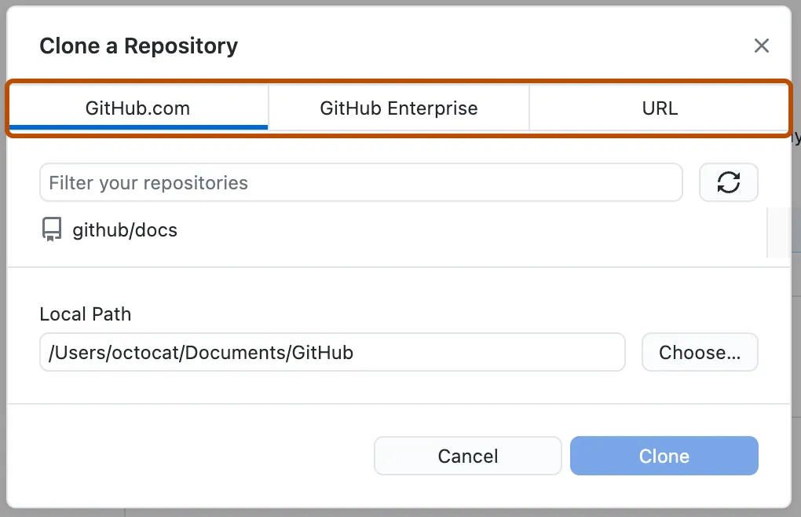
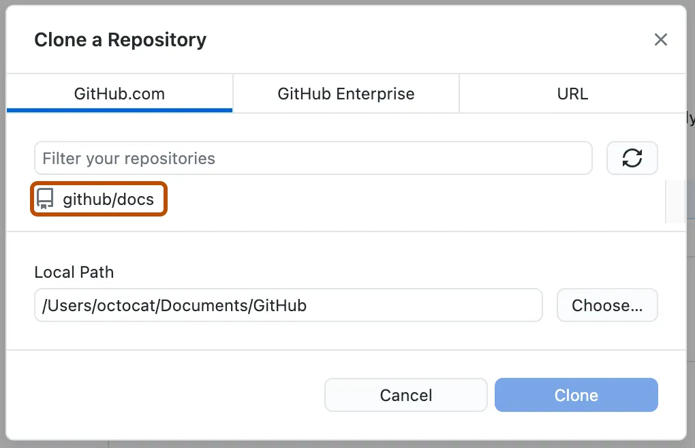
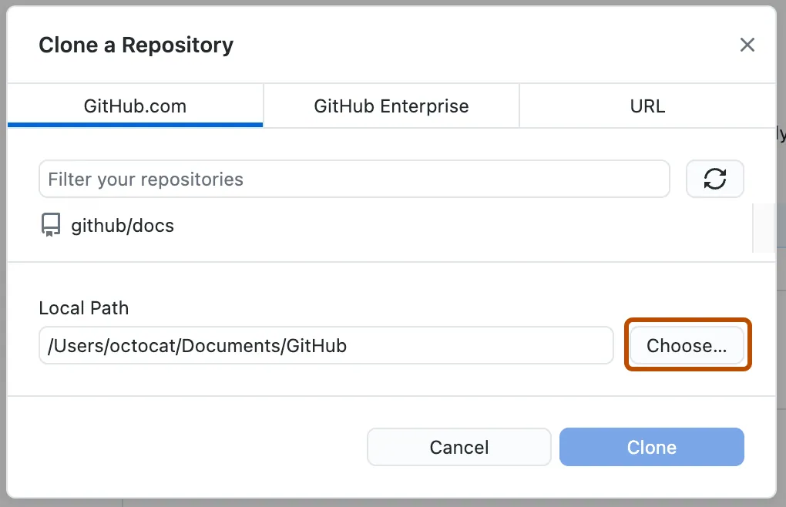
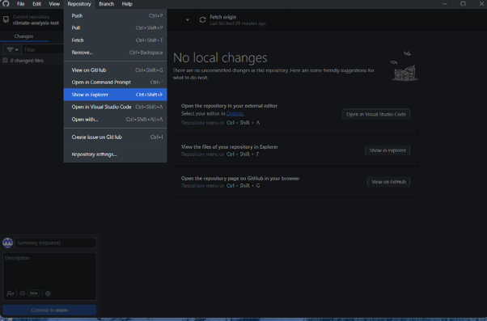
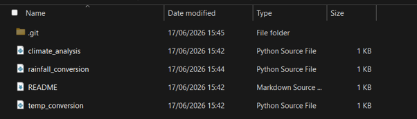
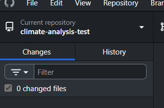

:::::::::::::::::::::::::::::::::::::: questions

- How do I create a version control repository?
- Where does Git store information?

::::::::::::::::::::::::::::::::::::::::::::::::

::::::::::::::::::::::::::::::::::::: objectives

- Create a repository from a template.
- Clone and use a Git repository with GitHub Desktop.
- Describe the purpose of the `.git` directory.

::::::::::::::::::::::::::::::::::::::::::::::::


## Creating a Repository

Now let's create a new repository for us to work on.

For convenience, we're going to work with some pre-existing template code that's already stored in a repository. The first thing we need to do is create our own copy of that template, which we can do on [GitHub](https://github.com).

[Go to our template repository](https://github.com/Southampton-RSG-Training/git-novice-template) and select **Use this template**:

{alt="Use Template"}

We should get prompted to give details for what we'd like our copy of the template to be called. As this demo code is for analysing climate data, we'll name our copy of it `climate-analysis`. We also want it to be public, so anyone can see and copy our code:

{alt="Repository Details"}

:::::::: callout

## Public or Private?

GitHub will allow you to create private repositories, so only people you specify can access the code, but it's always best to keep your code public - especially if you're going to use it in a paper!
Code that generates or analyses data is a fundamental part of your method, and if you don't include your full method in papers your work can't be reproduced, and reproducibility is key to the scientific process.
It's a good idea to keep your repositories public unless you've got a strong reason, like embargoes imposed by industrial partners.

A major advantage of this is if you leave academia, or you switch institution and forget to update the email on your GitHub account before you lose your old one, your work won't be lost forever!

::::::::::::::::

After a brief wait, GitHub will have created a **remote repository** - a copy of the files and their history stored on GitHub's servers.

## Cloning the Repository

1. In the File menu, click **Clone Repository**
{alt="File menu, clone repository selected"}

2. Click the GitHub.com because this is the location of the repository you want to clone. 
{alt="Clone a repository tab"}

3. From the list of repositories, click the repository you want to clone.  In this case **climate-analysis**.
{alt="Clone a repository tab with repository highlighted"}

4. To select the local directory into which you want to clone the repository, next to the "Local Path" field, click Choose... and navigate to the directory.
{alt="Clone a repository tab with choose directory button highlighted"}

5. At the bottom of the window, click **Clone**


:::::::: callout

## Creating Repositories Locally

We've shown you how to create a repository on GitHub and then clone it, but you don't have to do it that way.

If you already have a folder of code on your computer that you want to put under version control, you can use **File > Add Local Repository** in GitHub Desktop. If the folder isn't already a Git repository, GitHub Desktop will offer to initialise it as one for you.

You'll then see a **Publish repository** button in GitHub Desktop, which will create the matching **remote repository** on GitHub and link everything up in one step.

::::::::::::::::

## Exploring a Repository

Once cloning is complete, GitHub Desktop will show you your new repository.
To see the actual files, click **Repository** then **Show in Explorer** (Windows) or **Show in Finder** (Mac).

{alt="Show in Explorer option in the Repository menu"}

You should see the two Python files that make up our climate analysis code:

```
climate_analysis.py  temp_conversion.py
```

Don't worry, you don't need to know Python to follow along.

The folder looks like any other on your computer, nothing obviously special about it.
However, if you turn on **hidden files** in your file explorer, you'll spot a hidden folder called `.git`:

:::::::: tab

### Windows

In File Explorer, go to **View > Show > Hidden items**.

### Mac

In Finder, press <kbd>Cmd</kbd>+<kbd>Shift</kbd>+<kbd>.</kbd> to toggle hidden files.

::::::::::::

{alt="The hidden .git folder"}

Git stores all its information about the project in this `.git` directory.
If we ever delete it, we will lose the project's history.
GitHub Desktop manages this folder for you — you should never need to touch it directly.

### Check Status

Switching back to GitHub Desktop, you'll notice the **Changes** tab on the left is empty, with a message like *"No local changes"*:

{alt="GitHub Desktop showing no local changes"}

This means the files on your computer currently look exactly the same as the last snapshot stored in the repository.  In other words, there's nothing new to record yet.

You'll also notice the **current branch** is shown at the top of the window as **main**.
A **branch** is an independent line of development; we only have one at the moment.

:::::::: callout

## Branch Names

In this workshop, we have a **default branch** called **main**.
In older versions of Git, new repositories had a default branch called **master**, and you'll still see **master** used in many examples online.
Don't worry, branches work the same regardless of what they're called!

::::::::::::::::

:::::::: checklist


Before moving on, make sure you've:

- Created your copy of the template repository on GitHub.
- Cloned it to your local machine using GitHub Desktop.

::::::::::::::::::

::::::::::::::::::::::::::::::::::::: keypoints

- GitHub Desktop's **Clone** feature downloads a remote repository and links it to your local copy automatically.
- Git stores all of its repository data in the hidden `.git` directory.

::::::::::::::::::::::::::::::::::::::::::::::::
