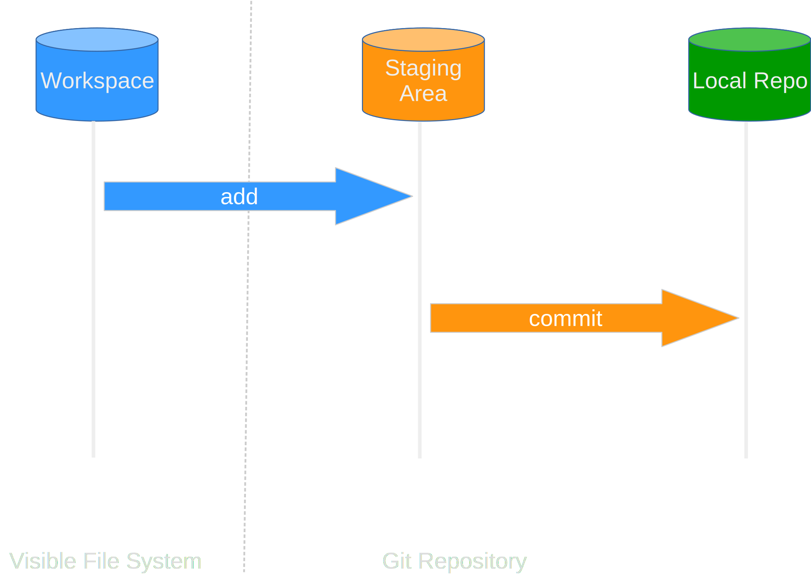

::::::::::::: questions

- How do I track the changes I make to files using Git?

:::::::::::::::::::::::

::::::::::::: objectives

- Go through the modify-stage-commit cycle for one or more files.
- Describe where changes are stored at each stage in the modify-stage-commit cycle.

:::::::::::::::::::::::

## Tracking Changes

We've got a repository now containing a few pre-existing files - so let's add one more.
You might remember GitHub suggesting we add a `README.md` to let people know what our code is about, so let's do that now.

### Creating a New File

Open your repository folder in your text editor.

The easiest way to do this is via GitHub Desktop: go to **Repository > Open with...**.

Select your preferred text editor or Integrated Development Environment (IDE) from the dropdown list.

Create a new file called `README.md` and add the following:

```
# Climate Analysis Toolkit

This is a set of python scripts designed to analyse climate datafiles.
```

Save the file. Our description is a bit brief, but it's enough for now!

TODO: For learners without an IDE installed, give the option to add a txt/md file using notepad.

### Untracked Changes

Switch back to GitHub Desktop. The **Changes** tab on the left now shows `README.md` with a small green plus sign next to it, meaning Git has spotted a new file it hasn't seen before:

TODO: {alt="Changes tab showing README.md as a new file"}

The panel on the right shows a **preview** of the file with new content highlighted in green.

You'll also notice the file is already **checked** (the checkbox next to its name is ticked). Only checked files will be included in your next commit.

### Initial Commit

Now we're ready to commit the first snapshot of our repository to Git.
At the bottom of the Changes panel, you'll see a **Summary** field and an optional **Description** field:

TODO: {alt="Commit message area in GitHub Desktop"}

The **Summary** is your commit message, which should be short and descriptive:

```
Add a basic readme file
```

Good commit messages start with a brief (<50 characters) but descriptive summary of changes made.

If you want to go into more detail, use the **Description** field below.

Once you've entered a summary, click **Commit to main**:

TODO: {alt="Commit to main button"}

When we commit, GitHub Desktop takes everything we've **checked** and stores a permanent snapshot inside the `.git` directory.
This snapshot is called a **revision**, and is assigned a unique short identifier (like `fa90884`).

After committing, the Changes tab will be empty again as there are no local changes.

### The Staging Area

The checkboxes in GitHub Desktop represent Git's **staging area**.  This is a holding space where you assemble the changes you want to include in your next commit, before actually committing them.

- **Checking** a file adds it to the staging area (equivalent to `git add` on the command line)
- **Clicking Commit** saves everything in the staging area as a new revision (equivalent to `git commit`)

{width="60%" alt="Stage and Commit"}

:::::::: callout

## What's the Point of the Staging Area?

Why do we have this two-stage process, where we **stage** changes, then **commit** them?

Among other reasons, it lets you bundle together a lot of related changes in one go.
If you renamed a variable used across multiple files (e.g. from `t` to `temperature`), you'd need to update all those files together for the change to make sense.
Committing file-by-file would leave you with a lot of broken intermediate versions.
The **staging area** lets you bundle all those small changes into one coherent commit.

GitHub Desktop checks all changed files by default — but you can uncheck individual files
(or even individual lines, using **partial staging**) to hold them back for a separate commit.

::::::::::::::::

### Review the Log

To see what we've done recently, switch to the **History** tab:

TODO: {alt="History tab showing commits"}

The History tab lists all **commits** to the repository, most recent at the top.
For each commit, you can see:

- The **commit message** (summary)
- The **author** and **timestamp**
- The short **commit identifier** (e.g. `fa90884`)
- Whether the commit has been **pushed to GitHub**.  Commits still only on your machine are shown as being ahead of `origin/main`

Click any commit to see a diff of exactly what changed in that snapshot.

### Modifying a File

Now suppose we modify an existing file. Open `climate_analysis.py` in your text editor and add a **docstring** at the very top of the file:

```python
""" Climate Analysis Tools """
```

Save the file and switch back to GitHub Desktop.
The Changes tab now shows `climate_analysis.py` with a yellow **M** badge, meaning it has been **M**odified:

TODO: {alt="Changes tab showing climate_analysis.py as modified"}

### Review Changes and Commit

It is good practice to always **review our changes** before committing them.
Click on `climate_analysis.py` in the Changes panel to see its **diff** — a view of exactly what has changed.
Additions are highlighted in **green** and deletions in **red**:

TODO: {alt="Diff view showing the new docstring line in green"}

GitHub Desktop's visual diff is much easier to read than the equivalent command-line output, making it easy to catch accidental changes before they're committed.

:::::::: callout

## What About Jupyter Notebooks?

Git works best with plain text files containing just code (or data).
Jupyter Notebooks store code, outputs, and metadata together in a complex JSON format, which can make diffs hard to interpret, even in GitHub Desktop's visual diff view.

Fortunately, the [nbdime](https://nbdime.readthedocs.io/en/latest/) Python package provides much cleaner diff views for notebooks, and can integrate with GitHub Desktop.

If you have large chunks of code in your notebooks, once you're confident they're correct it's best to split them out into `.py` files and import them back in.
It makes them work better with Git, and also makes them easy to reuse.

::::::::::::::::

After reviewing the change, enter a commit message:

```
Add docstring
```

and click **Commit to main**.

:::::::: callout

## Selectively Staging Changes

GitHub Desktop checks all changed files by default.
But what if you've changed several files and only want to commit some of them?

Simply **uncheck** the files you'd like to leave out, they'll keep their changes and remain in the Changes panel, ready to be committed separately later.

You can even stage individual **lines** within a file: right-click any line in the diff view and select **Stage Line**.
This is useful when you've made several unrelated tweaks to one file and want to commit them separately.

::::::::::::::::

Git requires us to **stage** files (check them) before committing them, because we may not want to commit **everything at once**.
For example, suppose we've **fixed a bug** in some existing code, but also written new code that's **not ready to share** yet.
We can stage and commit just the bug fix, leaving the work-in-progress for a later commit.

:::::::: challenge

## One More Change

We want to remind ourselves of some changes we need to make to a file.
Open `climate_analysis.py` in your text editor and add a line at the end saying:

```python
# TODO: Add rainfall processing code
```

Then review your changes in GitHub Desktop's diff view, and commit them with the message "Add rainfall processing placeholder".

When you're done, the Changes tab should show *"No local changes"*.

::::: solution

## Solution

Open `climate_analysis.py` in your text editor, add the TODO line at the end, and save.

Switch to GitHub Desktop — the Changes tab will show `climate_analysis.py` as modified.
Click on it to review the diff; you should see the new comment line highlighted in green at the bottom of the file.

Make sure the file is **checked**, then enter the summary:

```
Add rainfall processing placeholder
```

Click **Commit to main**. The Changes tab should now be empty.

::::::::::::::

::::::::::::::::::

Now we've got the basic loop of using Git sorted.  We make changes, review them in the diff view, stage what we want with the checkboxes, then create a new commit with a descriptive message.

:::::::: callout

## But What Do We Add?

We've gone over *how* you add to a repository, but *what* do you add?
Generally, you make one repository per project, paper or piece of software.
Then, you add things like:

- Your code.
- Configuration files for other software.
- Documentation, diagrams, or LaTeX manuscripts.
- For software, commonly-used, small-ish (megabytes) data files - e.g. lookup tables of atomic weights.
- For projects or papers, possibly the output files from software you've run - e.g. the results of an analysis.

Repositories shouldn't really be bigger than **1GB**.
If you store lots of different projects in one repository, it makes the history much less useful.

You *don't* add things that are large, and where the different versions can't really be meaningfully compared:

- Large data files - e.g. 10s of MB of sensor readings, survey results, observations.
  - These don't usually change, and if they do, you can't really compare the files *themselves*.
- Large output files - e.g. 10s of MB of simulation outputs, or processed data.
  - These don't need to be stored, as you can recreate them at any time from the inputs.
  - If they're large, you can't meaningfully compare them.

If you need to store and share data, rather than code & documentation, you can use Southampton's ePrints repository - see the [Library's Research Data Management pages](https://library.soton.ac.uk/researchdata-2024/sharing#s-lib-ctab-14751949-1).
Check your field's standards first, though.
Many fields have common, centralised places to store data to make it easier to find and use.

There's also Git Large File Storage, but GitHub limits the size of files you can store using it.
There's [a guide on large files and how to use Git Large File Storage on GitHub's website](https://docs.github.com/en/repositories/working-with-files/managing-large-files/about-large-files-on-github).
We'll introduce how to *ignore files* later on.

::::::::::::::::

:::::::: keypoints

- GitHub Desktop's **Changes** tab shows new, modified, and deleted files in your repository.
- The **checkbox** next to each file controls whether it will be included in the next commit — this is the staging area.
- A **commit** permanently records all staged (checked) changes as a snapshot in the repository.
- GitHub Desktop's **diff view** shows exactly what has changed in each file, with additions in green and deletions in red.
- Write commit messages that accurately describe your changes.
- The **History** tab lists all commits made to the repository, including which have been pushed to the remote.

::::::::::::::::::
