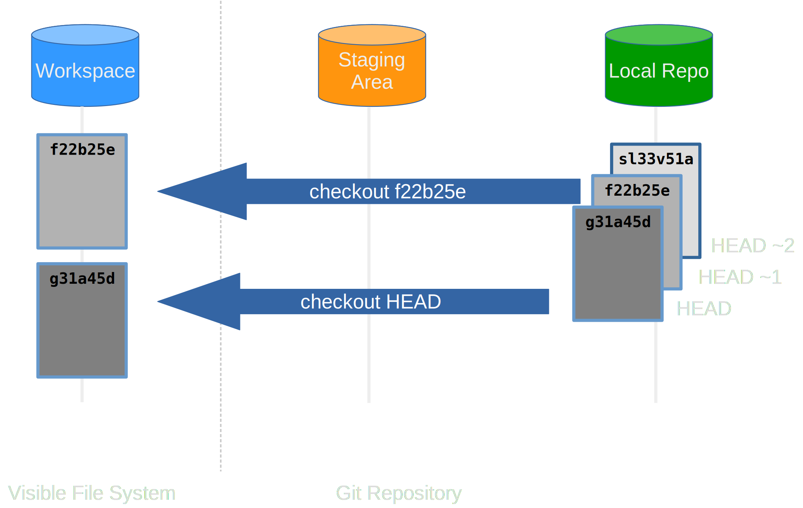

::::::::::::: questions

- How can I review my changes?
- How can I recover old versions of files?

:::::::::::::::::::::::

::::::::::::: objectives

- Navigate and understand Git revision history.
- Compare files with previous versions of themselves.
- Restore old versions of files.

:::::::::::::::::::::::

## Exploring History

We've seen that GitHub Desktop's **History** tab shows us commits, but let's look deeper at what we can do with that information.

Switch to the **History** tab. You should see a list of all commits to your repository, with the most recent at the top:

{alt="History tab showing list of commits"}

Each commit shows:

- The **commit message** (summary)
- The **author** and **timestamp**
- The short **commit identifier** (e.g. `f15ad11`)

The commit identifier is Git's way of uniquely identifying a snapshot of your code.
These are important because they let you refer to specific versions of your code, for example, the version you used to write a paper last year.

### Comparing Versions

To see what changed in a specific commit, **click on it** in the History tab:

TODO: {alt="Commit details showing diff"}

The right panel will show a **diff** of that commit.  This shows all the changes made in that snapshot.
Files are listed on the left, and clicking on a file shows the detailed diff on the right, with additions in **green** and deletions in **red**.

### Comparing Specific Commits

What if we want to compare our current version of a file to how it looked several commits ago?
We can do this by holding <kbd>Ctrl</kbd> (Windows) or <kbd>Cmd</kbd> (Mac) and selecting a range of commits in the History tab.

The right panel will then show a diff between the commits:

TODO: {alt="Comparing two commits selected in History tab"}

This lets us see exactly what changed between any two points in time, without needing to know commit IDs or count commits back from the present.

### Reverting Changes

All right: we can **save changes** to files and **see what we've changed**, but what if we need to **undo** changes we've made?

Suppose we accidentally modify a file and commit it, and now we want to undo that commit.
GitHub Desktop provides several ways to do this:

**Option 1: Revert a Commit**

If you want to **undo the changes made in a specific commit**, right-click on that commit in the History tab and select **Revert changes in commit**:

TODO: {alt="Right-click menu showing Revert This Commit"}

This creates a **new commit** that undoes the changes from the selected commit.
The old commit stays in the history (you can always see what you did), but its changes are reversed.

**Option 2: Discard Changes to a File**

If you've made changes to files in your working directory but **haven't committed them yet**, switch to the **Changes** tab.
Right-click on a file you want to undo and select **Discard Changes**:

TODO: {alt="Right-click menu showing Discard Changes"}

This will restore the file to its state in the last commit, throwing away any edits you've made.

:::::::: callout

## Why Revert, Not Delete?

You might wonder: why does reverting a commit create a *new* commit, rather than just deleting the old one?

The answer is that your full history is important.
You can always see what you did, when you did it, and who did it, even if you've since undone it.
This makes it easy to find bugs ("When did this function break?") and to understand how your code evolved.

If you deleted commits from history, you'd lose this record, making debugging and collaboration much harder.
So Git creates a new "undo" commit instead, keeping the full history intact.

This also means you can safely experiment: if you make a commit and realize it was a bad idea, you can always undo it with a revert commit.

::::::::::::::::

### A Practical Example

Let's say you accidentally delete `climate_analysis.py`. Here's how to recover it:

1. Your file disappears from the folder, and the Changes tab shows it as **deleted**
2. You realize this was a mistake
3. In the Changes tab, right-click on the deleted file and select **Discard Changes**
4. The file is restored to its last committed state

TODO: {width="60%" alt="Restoring Files"}

The fact that you can restore individual files tends to change the way people organize their work.

Consider a situation where all your code is in one file, and you fixed a bug in one section but accidentally introduced one elsewhere.
You can't just revert that commit without un-fixing the other bug.

However, if each section is in its own file, you can just revert the file you broke!
This is one reason why splitting code into multiple files is good practice.

:::::::: callout

## Tagging Important Versions

Sometimes you want to mark a specific commit as important, for example, the version of code you used to write a paper, or the first "released" version.

You can do this with **tags**. Right-click on a commit in the History tab and select **Create a Tag**:

TODO: {alt="Create a Tag option"}

Give it a meaningful name like `v1.0` or `paper-2024`:

TODO: {alt="Tag creation dialog"}

Tags appear in the History tab as labels on commits, making it easy to jump back to important versions.
Unlike branch names, tags are **permanent markers** that never change, making them ideal for marking specific versions.

::::::::::::::::

:::::::: keypoints

- GitHub Desktop's **History** tab shows all commits to your repository.
- Click on a commit to see its **diff** which shows exactly what changed in that snapshot.
- Select multiple commits to compare the differences between them.
- **Revert This Commit** creates a new commit that undoes a previous one, keeping the full history.
- **Discard Changes** (for uncommitted changes) lets you recover old code.

::::::::::::::::::
