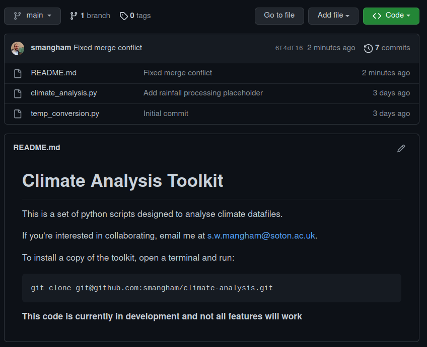

::::::::::::: questions

- How do I work with a remote repository?

:::::::::::::::::::::::

::::::::::::: objectives

- Understand how to push and pull changes to a remote repository.
- Encounter and resolve a conflict.

:::::::::::::::::::::::

We've learned how to use a **local repository** on our computer to store our code and view changes:

{width="60%" alt="Local Repository Commands"}

Now, however, we'd like to share the changes we've made to our code with others, as well as making sure we have an off-site backup in case things go wrong. We need to upload our changes from our **local repository** to the **remote repository** on GitHub.

:::::::: callout

## Why Have an Off-site Backup?

You might wonder why having an off-site backup (i.e. a copy not stored at your University) is so important.
In 2005, [a fire destroyed a building at the University of Southampton](https://news.bbc.co.uk/1/hi/england/hampshire/4390048.stm).
Some people's *entire PhD projects* were wiped out in the blaze.
To ensure your PhD only involves a normal level of suffering, please make sure you have off-site backups of as much of your work as possible!

{width="60%" alt="Mountbatten Fire"}

::::::::::::::::

The **remote repository** on GitHub is another repository, just like the **local repository** on our computer, that Git makes it easy to send and receive data from.
Multiple **local repositories** can connect to the same **remote repository**, allowing you to collaborate with colleagues easily.

{width="60%" alt="Remote Repositories"}

## Pushing Your Work to GitHub

Notice that in GitHub Desktop, the status bar at the top shows something like **"3 commits ahead of origin"**. This means we have made 3 commits locally that haven't been sent up to GitHub yet.

To synchronise our code to the remote repository, click the **Push origin** button:

{alt="Push origin button in GitHub Desktop"}

GitHub Desktop will upload your commits to GitHub. When it's done, the status bar will update to show you're **"up to date with origin"**:

{alt="Status bar showing up to date with origin"}

Now if you visit your repository on GitHub and refresh, you'll see your updates:

{alt="Updated remote repository"}

Conveniently, the contents of `README.md` are displayed on the main page with formatting.
[You can also add links, tables and more](https://docs.github.com/en/get-started/writing-on-github/getting-started-with-formatting-on-github/basic-writing-and-formatting-syntax).
Your code should always have a descriptive `README.md` file, so anyone visiting the repo can easily get started with it.

:::::::: callout

## How often should I push?

Every day. You can never predict when your hard disk will fail or your building will be destroyed!

{alt="In case of fire, git commit, git push, leave building"}
[Credit: Mitch Altman, CC BY-SA 2.0](https://www.flickr.com/photos/maltman23/38138235276)

::::::::::::::::

## Collaborating on a Remote Repository

Now we know how to **push** our work from our local repository to GitHub, we need to know the reverse — how to **pull** updates that someone else has made.

To demonstrate this, we'll update our `README.md` to welcome collaborators, then simulate a colleague making changes to the same file.

First, open `README.md` in your text editor and add a line about collaboration:

```
# Climate Analysis Toolkit

This is a set of python scripts designed to analyse climate datafiles.

If you're interested in collaborating, email me at your.email@soton.ac.uk.
```

Save the file, switch to GitHub Desktop, and **commit** this change with the message:

```
Add collaboration info
```

Then **push** it to GitHub. So far, this is the same as before.

### Creating a Conflict

Now we're going to pretend a colleague has also edited the `README.md` file on GitHub.
To do this, visit your repository on GitHub and click the **pencil icon** next to `README.md` to edit it directly:

{alt="GitHub edit button"}

Add some installation instructions and a note about the project status:

{alt="GitHub editing Readme"}

Commit the changes with a message like "Add installation instructions":

{alt="GitHub committing edit"}

Now you have a situation where:
- Your **local repository** has a commit about collaboration info
- Your **remote repository** has a different commit about installation instructions
- Both edited the same file (`README.md`)

This is a realistic scenario in collaborative work!

### Pulling and Resolving Conflicts

Switch back to GitHub Desktop. Notice the status bar now shows **"1 commit behind origin"** — there are changes on GitHub that you don't have locally.

Click the **Pull origin** button to download those changes:

{alt="Pull origin button in GitHub Desktop"}

GitHub Desktop will try to automatically merge the changes, but in this case it detects a **conflict** — both you and your simulated colleague edited the same part of the `README.md` file.

A notification will appear saying there are **conflicts to resolve**:

{alt="Notification of merge conflict"}

Click **Resolve Conflicts** to open GitHub Desktop's visual conflict resolution tool:

{alt="Visual conflict resolution tool"}

The conflict tool shows:

- **Left side**: Changes from the current branch (your local commit)
- **Right side**: Changes from the branch being merged (the remote commit)
- **Bottom**: The final merged result

For each conflicting section, you can:
- **Choose Current** to keep your local changes
- **Choose Incoming** to accept the remote changes
- **Manually edit** the bottom panel to combine both versions

In our case, we want to **keep both** the collaboration info and the installation instructions. 
Click in the bottom editing panel and combine both texts:

```
# Climate Analysis Toolkit

This is a set of python scripts designed to analyse climate datafiles.

To install a copy of the toolkit, open a terminal and run:

    git clone git@github.com:yourname/climate-analysis.git

**This code is currently in development and not all features will work**

If you're interested in collaborating, email me at your.email@soton.ac.uk.
```

Once you're happy with the merged content, click **Abort Merge** is replaced by a **Done** button. Click **Done**:

{alt="Conflict resolved - Done button showing"}

GitHub Desktop will now automatically create a **merge commit** that combines both sets of changes.
You'll see it in the History tab with a special merge commit icon.

The Changes tab will now show the merged `README.md` file. Review it to make sure it looks right, then the merge is complete!

Now you can **push** this merged version back to GitHub:

{alt="Push origin button after merge"}}

Click **Push origin** and your merged changes will be uploaded to GitHub:

{alt="Merged repository on GitHub"}}

### Why Conflicts Happen

Conflicts occur when:
- Two people edit the **same part** of the same file
- One person deletes a file that another person edits
- Two people add different content in the same location

Git can handle most automatic merges perfectly fine. Conflicts only happen in the relatively rare case where Git genuinely can't figure out which version is correct — in those cases, it asks a human (you) to decide.

:::::::: callout

## Reducing Conflicts with Branches

If you're working with multiple collaborators and conflicts become frequent, Git **branches** are your solution.
Each person can work on their own branch, and only merge back to `main` once their work is complete and tested.
This dramatically reduces the chance of conflicting edits to the same file.

We have a **Stretch Episode** that introduces branching in more detail!

::::::::::::::::

Now you can successfully collaborate with others on your research code. The general workflow is:

1. **Pull** at the start of your work session (get any changes your collaborators made)
2. Make changes and **commit** them locally
3. **Push** at the end of your session (share your changes)
4. If there are conflicts, use GitHub Desktop's visual tool to resolve them
5. **Push** the resolved version to finalize the merge

:::::::: keypoints

- Click **Push origin** in GitHub Desktop to upload your local commits to GitHub.
- Click **Pull origin** to download commits from GitHub that others have made.
- If both you and a collaborator edit the same part of a file, GitHub Desktop detects a merge conflict.
- Use GitHub Desktop's visual conflict resolution tool to choose which changes to keep, or combine both.

::::::::::::::::::
