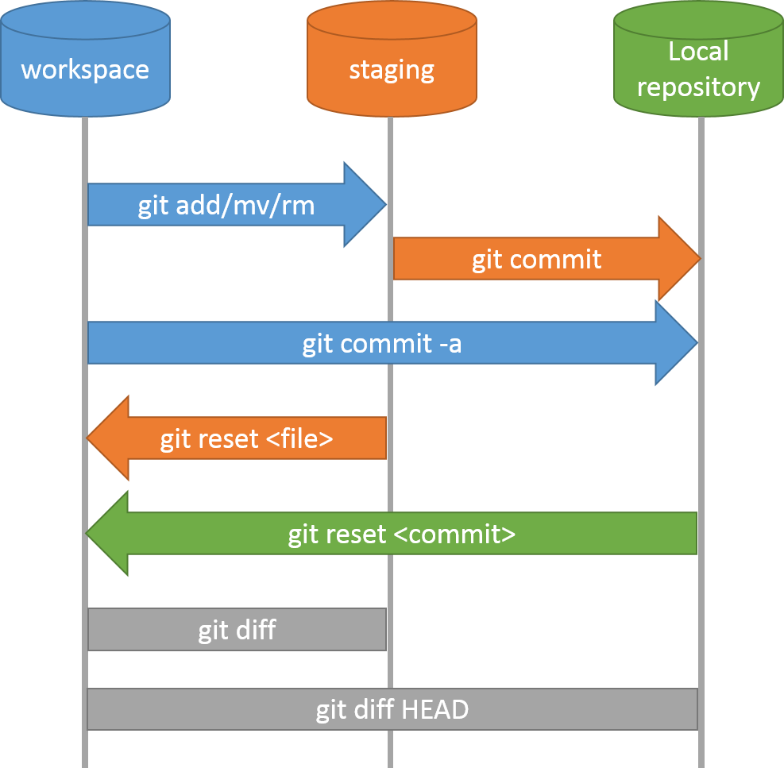
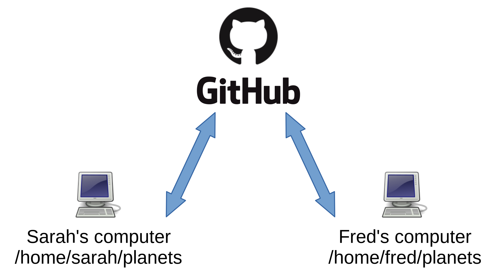
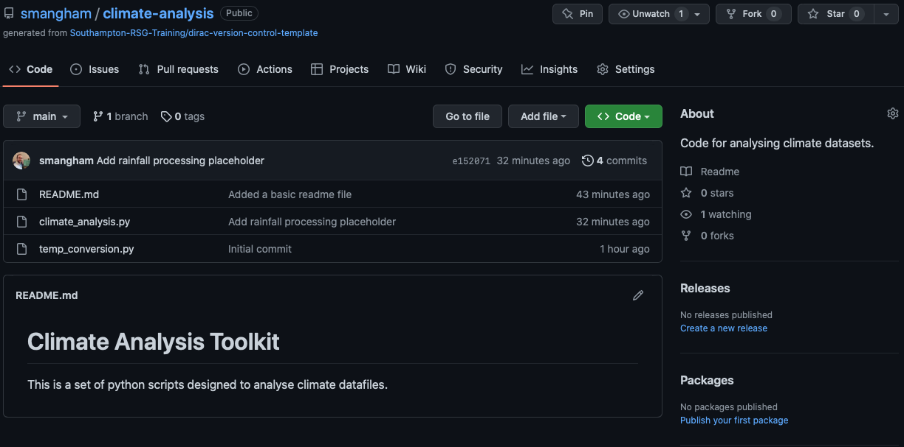
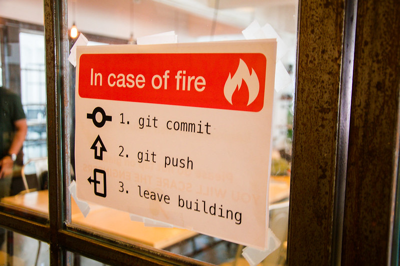
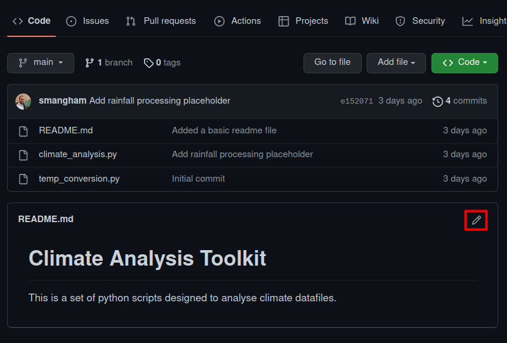
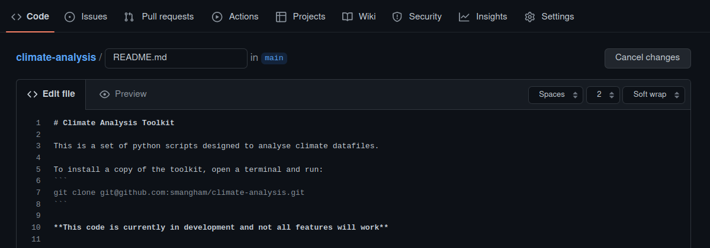
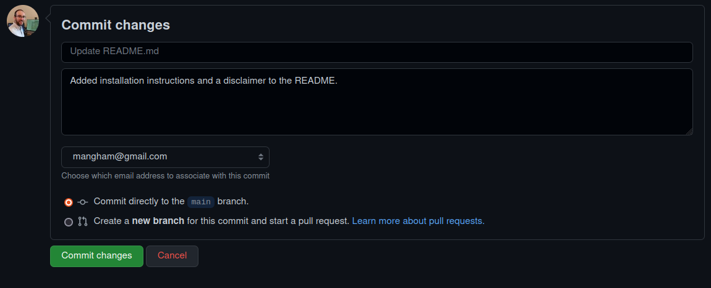

::::::::::::: questions

- How do I work with a remote repository?

:::::::::::::::::::::::

::::::::::::: objectives

- Understand how to push and pull changes to a remote repository.
- Encounter and resolve a conflict.

:::::::::::::::::::::::

We've learned how to use a **local repository** on our computer to store our code and view changes:

{width="60%" alt="Local Repository Commands"}

Now, however, we'd like to share the changes we've made to our code with others, as well as making sure we have an off-site backup in case things go wrong. We need to upload our changes from our **local repository** to the **remote repository** on GitHub.

:::::::: callout

## Why Have an Off-site Backup?

You might wonder why having an off-site backup (i.e. a copy not stored at your University) is so important.
In 2005, [a fire destroyed a building at the University of Southampton](https://news.bbc.co.uk/1/hi/england/hampshire/4390048.stm).
Some people's *entire PhD projects* were wiped out in the blaze.
To ensure your PhD only involves a normal level of suffering, please make sure you have off-site backups of as much of your work as possible!

{width="60%" alt="Mountbatten Fire"}

::::::::::::::::

The **remote repository** on GitHub is another repository, just like the **local repository** on our computer, that Git makes it easy to send and receive data from.
Multiple **local repositories** can connect to the same **remote repository**, allowing you to collaborate with colleagues easily.

{width="60%" alt="Remote Repositories"}

## Pushing Your Work to GitHub

Notice that in GitHub Desktop, next to 'Push Origin' at the top of the screen, there's an indication of how many commits we've made locally that haven't yet been pushed to GitHub yet. 

To synchronise our code to the remote repository, click the **Push origin** button:

TODO: {alt="Push origin button in GitHub Desktop"}

GitHub Desktop will upload your commits to GitHub. When it's done, the tab will show 'Fetch origin' rather than 'Push origin'.

TODO: {alt="Status bar showing up to date with origin"}

Now if you visit your repository on GitHub and refresh, you'll see your updates:

TODO: {alt="Updated remote repository"}

Conveniently, the contents of `README.md` are displayed on the main page with formatting.

Your code should always have a descriptive `README.md` file, so anyone visiting the repo can easily get started with it.

:::::::: callout

## How often should I push?

Every day. You can never predict when your hard disk will fail or your building will be destroyed!

{alt="In case of fire, git commit, git push, leave building"}
[Credit: Mitch Altman, CC BY-SA 2.0](https://www.flickr.com/photos/maltman23/38138235276)

::::::::::::::::

## Collaborating on a Remote Repository

Now we know how to **push** our work from our local repository to GitHub, we need to know the reverse - how to **pull** updates that someone else has made.

To demonstrate this, we'll update our `README.md` to welcome collaborators, then simulate a colleague making changes to the same file.

First, open `README.md` in your text editor and add a line about collaboration:

```
# Climate Analysis Toolkit

This is a set of python scripts designed to analyse climate datafiles.

If you're interested in collaborating, email me at your.email@soton.ac.uk.
```

Save the file, switch to GitHub Desktop, and **commit** this change with the message:

```
Add collaboration info
```

**But don’t push to GitHub just yet!** We’re going to set up a small conflict, of the kind you might see when working with a remote repository. What happens if you change a file at the same time as one of your collaborators does, and you both commit those changes? How does GitHub know which version of the file is ‘correct’?

### Creating a Conflict

Pretending to be an existing collaborator, we’ll go and add those installation instructions by editing our README.md file directly on GitHub.
To do this, visit your repository on GitHub and click the **pencil icon** next to `README.md` to edit it directly:

{alt="GitHub edit button"}

Add some installation instructions and a note about the project status:

{alt="GitHub editing Readme"}

Commit the changes with a message like "Add installation instructions":

{alt="GitHub committing edit"}

Now you have a situation where:
- Your **local repository** has a commit about collaboration info
- Your **remote repository** has a different commit about installation instructions
- Both edited the same file (`README.md`)

This is a realistic scenario in collaborative work!

### Push Conflicts

Great. Now let’s go back to GitHub Desktop and try pushing our local changes to the remote repository. This is going to cause problems, just as we expected:

Click the **Push origin** button:

TODO: {alt="Push origin button in GitHub Desktop"}

GitHub Desktop will produce a warning message saying that you're not able to push commits to this branch because there are commits on the remote that are not present on your local branch.

TODO: {alt="GitHub Desktop unable to push commits warning message"}

Click 'Fetch' and then click 'Pull Origin'.

GitHub Desktop will try to automatically merge the changes, but in this case it detects a **conflict** — both you and your simulated colleague edited the same part of the `README.md` file.

A notification will appear saying there are **conflicts to resolve**. Git has tried to auto-merge the files, but unfortunately failed. It can handle most conflicts by itself, but if two commits edit the exact same part of a file it will need you to help it.

TODO: {alt="Notification of merge conflict"}

Click 'Open with default program' to open the file in your text editor.


```
# Climate Analysis Toolkit

This is a set of python scripts designed to analyse climate datafiles.

<<<<<<< HEAD
If you're interested in collaborating, email me at s.w.mangham@soton.ac.uk.
=======
To install a copy of the toolkit, open a terminal and run:

    git clone git@github.com:smangham/climate-analysis.git


**This code is currently in development and not all features will work**
>>>>>>> 493dd81b5d5b34211ccff4b5d0daf8efb3147755
```

We can see the two different edits we made to the end of the README.md file, in a block defined by <<<, === and >>>. The top block is labelled HEAD (the changes in our latest local commit), whilst the bottom block is labelled with the commit ID of the commit we made on GitHub.

We can fix this by deleting all the markers and keeping the text we want:

```
# Climate Analysis Toolkit

This is a set of python scripts designed to analyse climate datafiles.

If you're interested in collaborating, email me at s.w.mangham@soton.ac.uk.

To install a copy of the toolkit, open a terminal and run:

   git clone git@github.com:smangham/climate-analysis.git


**This code is currently in development and not all features will work**
```

Now we’ve got a fixed and finished README.md file, save the file.  The conflict resolution window in GitHub Desktop should change to show all conflicts have been resolved.  Click **Continue merge**.

GitHub Desktop will now automatically create a **merge commit** that combines both sets of changes.
You'll see it in the History tab with a special merge commit icon.

The Changes tab will now show the merged `README.md` file. Review it to make sure it looks right, then the merge is complete!

Now you can **push** this merged version back to GitHub:

TODO: {alt="Push origin button after merge"}}

Click **Push origin** and your merged changes will be uploaded to GitHub:

TODO: {alt="Merged repository on GitHub"}}


:::::::: callout

## Reducing Conflicts with Branches

If you're working with multiple collaborators and conflicts become frequent, Git **branches** are your solution.
Each person can work on their own branch, and only merge back to `main` once their work is complete and tested.
This dramatically reduces the chance of conflicting edits to the same file.

We have a **Stretch Episode** that introduces branching in more detail!

::::::::::::::::

Now you can successfully collaborate with others on your research code. The general workflow is:

1. **Pull** at the start of your work session (get any changes your collaborators made)
2. Make changes and **commit** them locally
3. **Push** at the end of your session (share your changes)
4. Resolve any conflicts.
5. **Push** the resolved version to finalize the merge

:::::::: keypoints

- Click **Push origin** in GitHub Desktop to upload your local commits to GitHub.
- Click **Pull origin** to download commits from GitHub that others have made.
- If both you and a collaborator edit the same part of a file, GitHub Desktop detects a merge conflict.
- You can edit the file to combine the changes and resolve the conflict.

::::::::::::::::::
