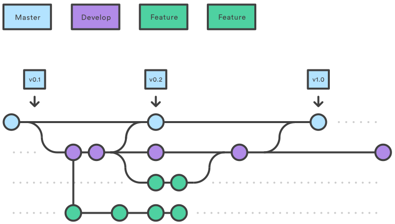

::::::::::::: questions

- What are branches?

:::::::::::::::::::::::

::::::::::::: objectives

- Understand why you would use a branch.
- Create and switch between branches.
- Merge branches together.

:::::::::::::::::::::::


We've seen branches mentioned a *lot* so far - mostly `main`.
So what are they?

A branch is a **parallel version of a repository**.
It can **branch off** from a commit, contain its own set of extra commits and edits to files, then easily **merge back** into the branch it came off (or even another!).
We can visualise this flow of splitting and merging branches like this:

{width="60%" alt="Git Feature-branch workflow"}

## Why Use Branches?

If you're a user of a code, and don't plan to do any development, you might never have to interact with branches.
You'll download the `main` branch, containing the most recent, stable version of the code, and just use that.
Likewise, if you create a new repository for a small code with only a single developer, then as long as you aren't sharing the code or its outputs you can just do all your work on the `main` branch like we've been doing.

However, if you plan on **making changes to an existing code**, **collaborating with others**, or **sharing your code or its outputs**, then you'll definitely want to use branches — as they make your life a lot easier.

### Sharing Your Code: `main` and `dev` branches

As mentioned, if you're using an existing code written by somebody else, you'll typically just download the `main` branch and use that.
What if, though, the author(s) of the code want to continue working on it without the potential users downloading half-finished or untested code?
They could keep all their changes local and only commit and push once a new feature has been completed and rigorously tested, but that's not particularly sustainable for large features.
It could potentially take months to add a new feature (a long time to go without a backup!), and you might want to share the work-in-progress version with others to test.

The traditional way to do this is to create a **development branch (`dev` or `develop`) coming off the main branch (`main`)**.
The **main branch** contains tested, finished code that can be shared with others, whilst the **development branch** contains work-in-progress code.
Typically you **merge** your development branch into your main branch when your work has been tested and is ready to share — for example, when you release a paper using it.
Then you can continue working on your development branch and sharing development code with other members of your group.

### Making Changes to an Existing Code: Feature branches

Once you have a working code, particularly one that's being shared, you'll inevitably want to add new features.
You could add them directly to your development branch — however, what happens if, mid-way through, you need to pause the feature and switch to something else as you wait for simulations to finish, new data to arrive, or similar?
Instead of ending up with a mess of multiple half-finished modifications, you can instead create a new **feature branch coming off of your development branch** for each new feature.
You work on each new feature or bugfix in their own **feature branch**, and merge them back into your **development branch** once they're tested and complete.
Then, as before, once you're ready to publish a paper using your new functionality you merge it all back into the **main branch**.

### Collaborating With Others: Feature branches

Feature branches also make collaborating with others far easier!
Instead of stepping on each other's toes by making conflicting edits to the same files, you can simply each work on your own branch.
GitHub offers features to help manage collaborations too, by limiting who can merge their work into a branch without approval, allowing you to set up workflows where newer team members run their changes past those with experience.

## Merging

We've mentioned **merges** repeatedly; as Git tracks the *changes* made to each file in each commit, it can easily determine whether or not the changes made in two branches **conflict** with each other.
It can intelligently merge together two modified versions of a file where their changes don't overlap, and highlight sections where they do for you to resolve, showing both versions of the code.

These use the same conflict resolution we saw earlier — new files are added seamlessly, whilst modified files use smart conflict resolution and might need your intervention if there's a clash!

## The Basics

In GitHub Desktop, look at the top of the window. You'll see the current branch displayed:

TODO: {alt="Branch dropdown showing main"}

Click on it to see all available branches and create new ones:

TODO: {alt="Branch dropdown menu"}

TODO: Click **New Branch** to create a new branch:

{alt="New Branch button"}

A dialog will appear asking for the branch name and which branch it should come off:

TODO: {alt="New Branch dialog"}

Let's create a `dev` branch coming off `main`. Enter `dev` as the branch name and make sure `main` is selected as the "Create branch based on" option. Click **Create Branch**.


### Working with a `dev` branch

You're now switched to the `dev` branch. You can see it displayed in the branch dropdown at the top of the window.

Any commits we make on this branch will exist *only* on this branch. When we switch back to `main`, they won't show up.

Let's try it out. We'll create a new text file for a rainfall conversion information.
Open your repository in your text editor and create a new file called `rainfall_conversion.txt`:

```
Rainfall Conversion

Note: mm = inches x 25.4
```

Save the file and switch back to GitHub Desktop. You should see `rainfall_conversion.txt` in the Changes tab as a new file.
Commit it with the message:

```
Add rainfall module
```

Now let's see what happens when we switch back to `main`. Click the branch dropdown and select `main`:

TODO: {alt="Switching back to main branch"}}

Now go to your file explorer and look at your repository folder.
The `rainfall_conversion.py` file has disappeared!

It hasn't been deleted — it still exists safely in the `.git` directory, stored as part of your `dev` branch.
Switch back to `dev` (click the branch dropdown and select `dev`), and it will reappear.

This is the power of branches: you can have completely different versions of your code on different branches, and switch between them instantly.
If you edit an existing file on `dev`, then when you switch back to `main` you'll see the old version.

### Publishing Your Branch

Now we've made changes to our `dev` branch, we want to send them up to GitHub to make sure we don't lose our development work.
Make sure you're on the `dev` branch, then look at the top of GitHub Desktop.

Since this is a new branch that doesn't exist on GitHub yet, you'll see a **Publish branch** button:

TODO: {alt="Publish branch button"}}

Click **Publish branch** and GitHub Desktop will upload your new branch to GitHub.

If you visit your repository on GitHub and click the branch dropdown, you'll now see both `main` and `dev` listed:

TODO: {alt="Branch dropdown on GitHub"}}

You can switch between them on GitHub to see what each branch contains. GitHub will also suggest creating a **Pull Request** when it detects a recently-pushed branch:

TODO: {alt="Pull Request suggestion on GitHub"}}

### Merging Branches

If we're happy with the way our work on the `dev` branch has gone, and we've tested it, we can merge the content back into `main`!

First, let’s switch back to our main branch in GitHub Desktop.

Then, go to the **Branch** menu and select **Choose a branch to merge into main**. A dialog will appear asking which branch you want to merge into the current one. Select **dev**:

TODO: {alt="Merge menu option"}}


Click **Create a Merge Commit**.

GitHub Desktop will merge the `dev` branch into `main`:

TODO: {alt="Merge complete"}}

You'll see the commit from your dev branch appear in the History tab of your main branch.
The `rainfall_conversion.txt` file will now appear in your working directory on the `main` branch.

Now push these changes to GitHub using the **Push origin** button:

TODO: {alt="Push after merge"}}

Both branches are now up-to-date on GitHub, and your new feature has been integrated into the main version of your code!

:::::::: callout

## Pull Requests

When we push a new branch to GitHub, GitHub suggests creating a **Pull Request** — another way of merging branches that works better when you're part of a team.

A **Pull Request** is a GitHub feature that lets your team:
- Discuss the changes you've made
- Request peer review of your code
- See all your changes in detail before merging

Instead of merging directly, you create a Pull Request on GitHub, your team reviews it, and then someone approves and merges it.

If you're working as part of a team, **Pull Requests** are better than using GitHub Desktop's merge feature, as they provide a formal review process and create a record of discussions.

You can create a Pull Request by clicking the **Pull Request** button that appears when you push a new branch, or by going to your repository on GitHub and clicking **New Pull Request**.

::::::::::::::::

## Summary: The Branching Workflow

A typical workflow for developing new features looks like this:

1. **Create a new branch**  (e.g., `dev`)
2. **Switch to that branch** in GitHub Desktop
3. **Make changes and commit** them — they only affect your dev branch
4. **Publish the branch** to GitHub to back it up
5. **Test thoroughly** and make sure everything works
6. **Merge back into `main`** when ready
7. **Push the merge** to GitHub

This keeps your `main` branch stable and tested, whilst allowing you to experiment on your dev branch.

:::::::: keypoints

- Branches are parallel versions of a repository that can be merged together.
- Click the **branch dropdown** at the top of GitHub Desktop to create, switch, and view branches.
- **Publish branch** sends a new branch to GitHub.
- **Merge into Current Branch** combines changes from one branch into another.
- Branches help with code sharing, collaboration, and keeping `main` stable whilst developing new features.

::::::::::::::::::
